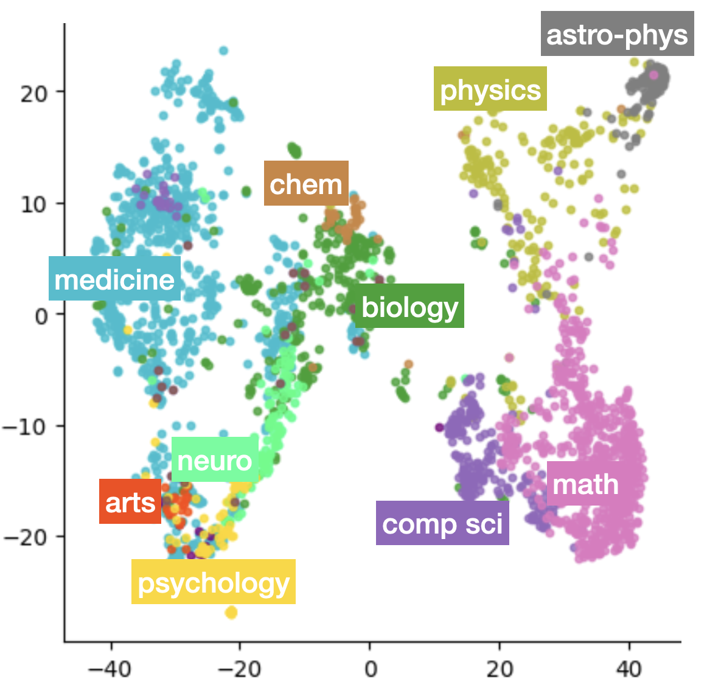

# MIReAD
**✨ MIReAD is accepted to ACL 2023 ✨**


"MIReAD: simple method for learning high-quality representations from scientific documents" by Anastasia Razdaibiedina and Alexander Brechalov.

MIReAD is a transformer-based model that extracts high-quality representations from scientific papers using solely abstract and title. Such representations are suitable for similar papers retrieval, topic categorization and recommender system usage.

This repository contains:
* MIReAD code & evaluation scripts
* link to the pre-trained model weights
* link to the training data
* instructions to use MIReAD

## Loading pretrained model

MIReAD weights are available through 🤗 HuggingFace Transformers: [https://huggingface.co/arazd/MIReAD](https://huggingface.co/arazd/MIReAD).

Requirement: `pip install --upgrade transformers==4.2`

```python
from transformers import AutoTokenizer, AutoModel

# load model and tokenizer
tokenizer = AutoTokenizer.from_pretrained('arazd/miread')
model = AutoModel.from_pretrained('arazd/miread')
```

Extracting embeddings and journal prediction:
```python
# concatenate title & abstract
title = 'MIReAD: simple method for learning scientific representations'
abstr = 'Learning semantically meaningful representations from scientific documents can ...'
text = title + tokenizer.sep_token + abstr
inputs = tokenizer(text, padding=True, truncation=True, return_tensors="pt", max_length=512)

# classification (getting logits over 2,734 journal classes)
out = model(**inputs)
logits = out.logits

# feature extraction (getting 768-dimensional feature profiles)
# IMPORTANT: use [CLS] token representation as document-level representation (hence, 0th idx)
out = model.bert(**inputs)
representation = out.last_hidden_state[:, 0, :]
```

A sample script to run the model in batch mode on a dataset of papers is provided under `scripts/embed_papers_hf.py`

How to use:
```
CUDA_VISIBLE_DEVICES=0 python scripts/embed_papers_hf.py \
--data-path path/to/paper-metadata.json \
--output path/to/write/output.json \
--batch-size 8
```
